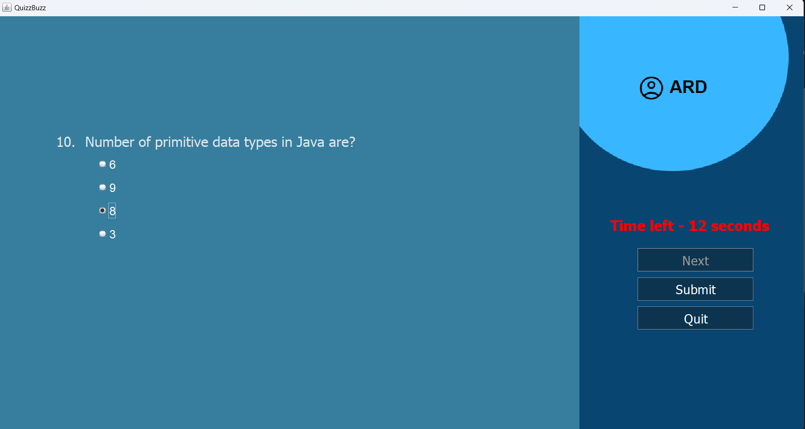

# QuizzBuzz
The quiz application developed using Java Swing is a user-friendly program that allows users to participate in interactive quizzes. The application provides a graphical user interface (GUI) that enhances the user experience.
## Login Window

### Enter username

## Rules Button
Takes user to the rules page.  

## Continue button 
Takes user to the next window.  

## Rules Window
Greets the user and showes them the rules.

### Back Button
Takes the user mack to the Login window.
### Start Button
Takes the user to Quiz window.

## Quiz Window
1. Quiz questions
2. 4 options to chose answer.
3. Right upper corner provied the name of current user.
### Option panel
1. Timer (15 sec for each question).
2. Next Button to go to next question.
3. Submit button (Avaiable at 9th question).
4. Quit button (Takes back to Login Window).

### Submit Button
Available at the 9'th question.

## Score Window
1. Final score of the user is presented
2. Play again option given

### Play again button
Takes to the Login window.

